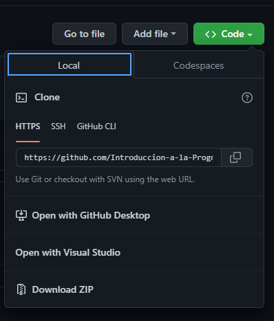
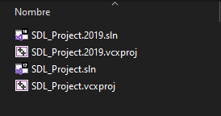

# SDL_Project

Este proyecto puede ser descargado como archivo ZIP desde Github.

Luego al descomprimir abrir el archivo "SDL_Project.sln" dentro de la carpeta "project".

> Si desea usar Visual Studio 2019, abra ./project/Ejercicio-01.2019.sln

---

### Para descargar Visual Studio Community Edition 2022

*	Descargar Visual Studio Community Edition desde el siguiente Link -> [Visual Studio Community Edition Link](https://visualstudio.microsoft.com/es/thank-you-downloading-visual-studio/?sku=Community&channel=Release&version=VS2022&source=VSLandingPage&cid=2030&passive=false)

---
 ### Para Crear un proyecto de Consola.

 IR al enlace [Consola](doc/CONSOLE.md#section-1)

### Creditos

"Music by Bensound.com"