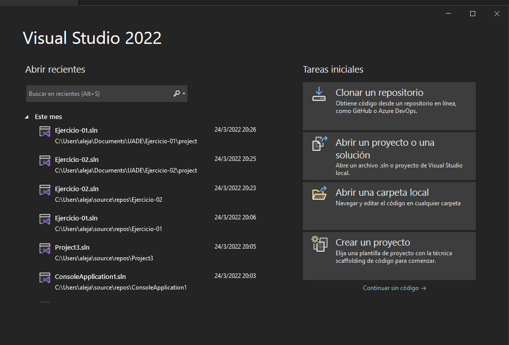
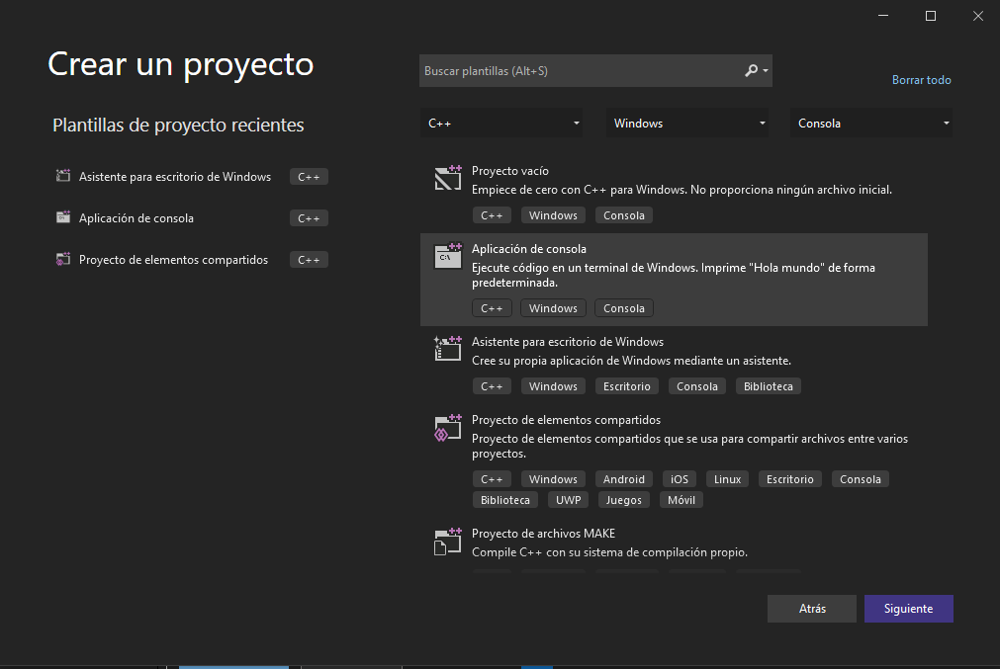
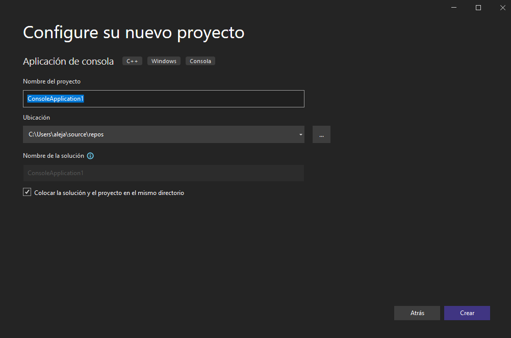
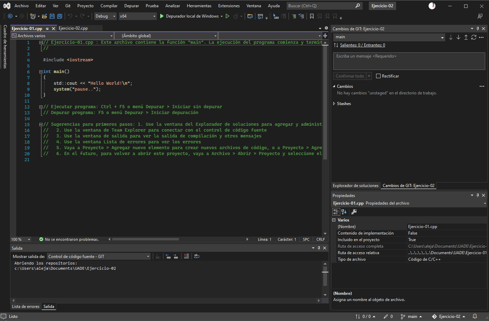

## Section 1

1.	Una vez que este instalado, abrilo que vas a ver una ventana parecida a la siguiente y  hacele click en Crear un Proyecto.

 
2.	Fijate en la siguiente ventana que aparece de seleccionar "Aplicación de consola"

 
3.	Y finalmente seleccionar la carpeta destino donde se guardaran los archivos y donde podras colocar el nombre del proyecto.

 
4.	Listo ahi si podes escribir tu codigo!
